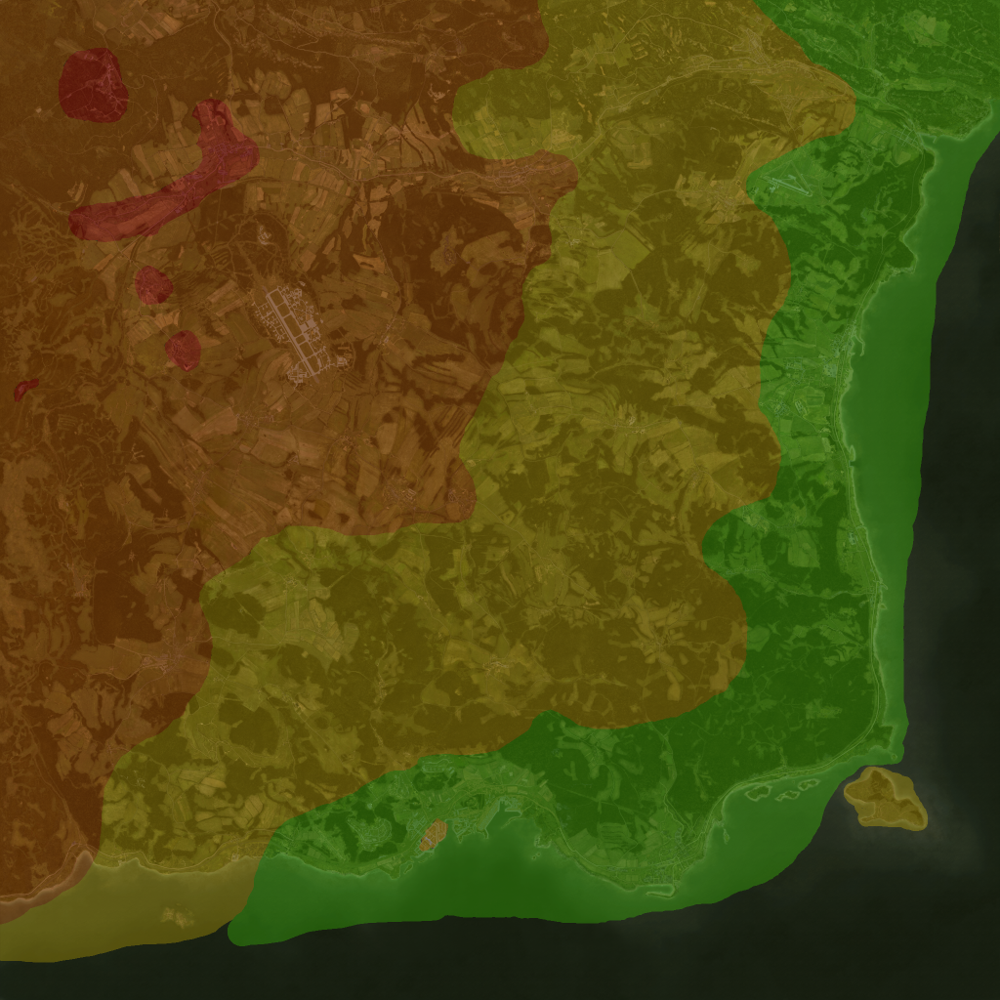

# Phantom Dayz Console Configuration Tutorial

This is a tutorial to customize a Dayz Server for Console. 

I collected this knowledge by being an admin for 9 months and I wanted to make this knowledge public to others, so they can easily know how to customize their servers.

## Table of content
- [Editing the files](#Editing-the-files)
- [Concepts](#concepts)
- [General configurations](#global-configurations)
- [Messages configurations](#Messages-configurations)
- [Items configurations](#Items-configurations)
- [Loadout and attachments customizations](#loadout-and-attachments-customizations)
- [Events configurations](#events-configurations)
- [Territory flags configurations](#territory-flags-configurations)
- [Change players spawn location](#change-players-spawn-location)
- [Car related configurations](#car-related-configurations)
- [References](#References)


## Editing the files
I strongly suggest you use an external editor to modify the configuration files. You could edit the files directly on the server, but by doing that you have higher chances to mess up the files.

> A tiny caracter at the wrong place, can messed up the game by preventing zombies from spawning or preventing loot from spawning or prevent cars from spawning or make your player spawn at the default spawns,  etc.

### Editing tools
In order to efficiently edit the dayz config, you need a few tools : 
- A PC (or a mac) : in order to install the other tools.
- [Notepad++](https://notepad-plus-plus.org/downloads/) editor to edit the configuration files
- Notepad++ XML Tools pluggin to validate the xml configuration files (to install go to notepad++ ___Pluggins->Pluggins admin___ menu).

You could edit the files directly on the server, but by doing that you have chances to mess up the files.

> A tiny caracter at the wrong place, can messed up the game by preventing zombies from spawning or preventing loot from spawning or prevent cars from spawning or make your player spawn at the default spawns,  etc.

### Back ups
Before editing your files, you should always make a copy of the originals in case you overrite a important configuration or in case you messup a configuration file and you need to roll back your customizations.

## Global configurations

### How to change the despawn timers of things in the world ?
Ruined items, dead players, animals and dead zombies despawn timer can be changed. 
1. Open the file ___Globals.xml___.
2. Find the appropriate tag you want to change :
```xml
    <var name="CleanupLifetimeDeadAnimal" type="0" value="1200"/>
    <var name="CleanupLifetimeDeadInfected" type="0" value="330"/>
    <var name="CleanupLifetimeDeadPlayer" type="0" value="3600"/>
    <var name="CleanupLifetimeDefault" type="0" value="45"/>
    <var name="CleanupLifetimeLimit" type="0" value="3600"/>
    <var name="CleanupLifetimeRuined" type="0" value="330"/>
```
3. Change the ___value___ attribute of the item you want 
> Values are in seconds. Here ___3600___ means it is a ___60 seconds per minute X 60 minutes___ = ___1 hour___
4. Save the file and restart the server.

### How to change the maximum number of items found on the map ?
Dayz limits the number of items you can find on the map to ___1200___. You can change this value, but be warn it can affect the server performance.
1. Open the file ___Globals.xml___.
2. Find the ___SpawnInitial___ tag :
```xml
<var name="SpawnInitial" type="0" value="1200"/>
```
3. Change the ___value___ attribute of the number of items you want to spawn on the map.
4. Save the file and restart the server.

### How to change the maximum number of zombies on the map ?

Dayz limits the number of zombies players can encounters on the map to ___800___. You can change this value, but be warn it can affect the server performance.
1. Open the file ___Globals.xml___.
2. Find the ___ZombieMaxCount___ tag :
```xml
<var name="ZombieMaxCount" type="0" value="800"/>
```
3. Change the ___value___ attribute of the number of zombies you want on the map.
4. Save the file and restart the server.

### How to change the maximum number of animals on the map ?

Dayz limits the number of animals players can encounters on the map to ___200___. You can change this value, but be warn it can affect the server performance.
1. Open the file ___Globals.xml___.
2. Find the ___AnimalMaxCount___ tag :
```xml
 <var name="AnimalMaxCount" type="0" value="200"/>
```
3. Change the ___value___ attribute of the number of animals you want on the map.
4. Save the file and restart the server.


## Messages configurations
Dayz allow you to display a message (in red) at the bottom the screen of players. In order to customize those messages you have to modify the ___message.xml___ file. 

See this link on how to configure the messages you want to display : 
[DayZ:Server Messages](https://community.bistudio.com/wiki/DayZ:Server_Messages)


## Items configurations
Items definitinos in dayz are found in the file ___type.xml___. There you can change how items spawns.

An item is define like this, for example the ___canteen___ item :

```xml
	<type name="Canteen">
		<nominal>30</nominal>
		<lifetime>3600</lifetime>
		<restock>600</restock>
		<min>15</min>
		<quantmin>50</quantmin>
		<quantmax>100</quantmax>
		<cost>100</cost>
		<flags count_in_cargo="0" count_in_hoarder="0" count_in_map="1" count_in_player="0" crafted="0" deloot="0"/>
		<category name="food"/>
		<usage name="Military"/>
		<usage name="Hunting"/>
		<usage name="Town"/>
		<usage name="Village"/>
		<value name="Tier1"/>
    	</type>
```

- The ___nominal___ tag is the ___average___ number of this kind of items you will find in the world. 
> In this case ___30___.
- The ___lifetime___ tag is the time in seconds the item will stay on the map ___if untouched___ before it despawns.
> In this case ___60 seconds X 60 minutes = 1 hour___.
- The ___min___ tag is the minimum number of this type of item you will find on the map. When the number of items of this kind in the world reaches this value, a new item of this type will be set to respawn after the number of second set in the ___restock___ value.
> In this case ___15___.
- The ___restock___ tag is the time before an item of this type respawns when the minimum number of items of this type reaches the ___min___ value. 
> In this case ___10___ minutes (600 seconds).
- The ___quantmin___ and ___quantmax___ tags is for items that contains quantities of somethings (pills, liquid, ammo, etc.). It is the random ___minimal and maximal percentage (%)___ this item will be filled with.
> In this case it will be filled between ___50% and 100%___.
- The ___cost___ tag is the priority this item will be spawn over to others. 
> In this case ___100___.
- The ___flags___ tag tells how the game engine counts or spawn the items on the maps. 
	- The ___count_in_cargo___ attribute is for items stored in container items (cars, tents, etc.).
	- The ___count_in_hoarder___ attribute is for items stored in containers your wear.
	- The ___count_in_map___ attribute for items spawned in buildings and area all around the map.
	- The ___count_in_player___ attribute for items your wear.
	- The ___deloot___ attribute tells this item will only spawn on events (like helicrashes).
	- The ___crafted___ attribute I have no idea.
	- The ___value___ attribute will tell in which ___[tier](#tiers#)___ of the map the items will spawn.
> ___1 = true___ and ___0 = false___
- The ___category___ tag is used to categorize items and is used in the ___mapgrouppos.xml___ file to spawn certain types of items in buildings.
> In this case ___food___.
- The ___usage___ tag is used to tell in which type of area this item can spawn. 
> In this case ___Military, Hunting, Town and Village___.
- The ___value___ tag is used to tell in which tier of map this item can spawn. 

### Tiers
The dayz map is divided in 4 tiers. Tiers are used to define area where certain items can spawn. 

Here is a list of all possible values for the ___value___ parameter
- Tier1 (green).
- Tier2 (yellow).
- Tier3 (orange).
- Tier4 (red).



### Usage 
The ___usage___ tag is used to tell in which type of area this item can spawn.

Here is a list of all possible values for the ___usage___ parameter:

- Coast
- Farm
- Firefighter
- Hunting
- Industrial
- Medic
- Military
- Office
- Police
- Prison
- School
- Town
- Village

### Category
The ___category___ tag is used to categorize items and is used in the ___mapgrouppos.xml___ file to spawn certain types of items in buildings.

Here is a list of all possible ___category___ parameter values :
- clothes
- containers
- explosives
- food
- tools
- weapons
- vehiclesparts

### Tag
Tags are use to specify where to which specific location in a building an item should spawn.
Here is a list of all possible ___tag___ parameter values : 
- shelves
- floor

### How to change how many items spawns ?
Change the ___nominal___ value.

### How to make items spawn full ?
Items containing ammo, pills and liquids, etc. will spawn full if you set ___quantmin___ to ___100___ and ___quantmax___ to ___100___

### How to prevent an item from spawning ?
If you don't want a particular item to randomly spawn on the map : 
1. Open the file ___type.xml___.
2. Find the item you want to prevent from the spawning on the map.
3. Change the ___nominal___ value and ___min___ value of that item to ___0___
4. Restart the server.

> This will not despawn any items of this type already spawned on the map.

### How to change the time an item takes to spawning ?
If you don't want a particular item to randomly spawn on the map : 
1. Open the file ___type.xml___.
2. Find the item you want to prevent from the spawning on the map.
3. Change the ___lifetime___ value to the time in ___seconds___ you want it to despawn.
4. Restart the server.

> This will not affect any items already spawned on the map.

### How to spawn a particular item type in a specific area type 
You can specify where items can spawn. In order to do that you have to add (or remove) a ___usage___ tag to the type of item you want.
1. Open the file ___type.xml___.
2. Find the item you want to spawn on the map.
3. Change the ___usage___ value of the desired usage location (see [Usage](#Usage))
4. Restart the server.

## Loadout and attachments customizations

In Dayz you can cutomize loadout of zombies, npcs, vehicules and container items (bags, seachest, giftbox, etc)

> Warning : if you change the loadout of an item, all items of this type will spawn with that loadout, custom spawns et randow spawns.

Loadouts of items are configuration in the file ___cfgspawnabletypes.xml___. 

> If an item entry is missing from this file, you can add a new entry with the item name of this item. For example if you want refridgerators to spawn food and drinks just add : 

### How to change the loadout of container items ?
Container items like 

```xml
	<type name="Refridgerator">
		<cargo chance="0.50">
			<item name="Vodka" chance="1.00" /> 
		</cargo>
		<cargo chance="1.00">
			<item name="Vodka" chance="0.50" /> 
			<item name="SodaCan_Pipsi" chance="0.50" /> 
		</cargo>
		<cargo preset="foodVillage" />
		<cargo chance="1.00">
			<item name="WaterBottle" chance="1.00" /> 
		</cargo>
		<cargo chance="1.00">
			<item name="WaterBottle" chance="1.00" /> 
		</cargo>
	</type>
```
- The ___type___ tag is used to refer to the ___name___ of the item you want to set the loadout.
 
- The ___cargo___ tag is used to set the items you want to load in the container item. You can set a ___chance___ attribute to this tag in order to specify the randomness of an item to get load in the container item.

- The ___item___ tags are use to set the item you want to load. You can set a ___chance___ attribute to this tag in order to specify the randomness of an item to get load in the container item. Multiple items can be set inside a ___cargo___ tag, but only one of these item will get load.
> In order to spawn multiple item of the same type, add multiple ___cargo___ tags with the same item inside them (see WaterBottle item the above example).

- You can also use preset in order to spawn items inside container items. Presets are define in the file ___cfgrandompresets.xml___ 
```xml
	<cargo chance="1.0" name="foodVillage">
		<item name="TunaCan" chance="0.50" />
		<item name="WaterBottle" chance="0.25" />
		<item name="Apple" chance="0.25" />
	</cargo>
```

> Tips : if you use container items to spawn items on the map, disable the random spawns of this type of item (see [How to prevent an item from spawning](#How-to-prevent-an-item-from-spawning).

### How to change the items attachments ?
Some items like guns, helmets, zombies, NPCs and cars have attachments. You can set which attachments spawns with those types of items in the file ___cfgspawnabletypes.xml___ like this : 

```xml
	<type name="ZmbM_PrisonerSkinny">
		<attachments  chance="1.00">
			<item name="GreatHelm" chance="1.00" />
		</attachments>
		<attachments  chance="1.00">
			<item name="Sword" chance="1.00" />
		</attachments>
		<attachments  chance="1.00">
			<item name="PrisonUniformJacket" chance="1.00" />
		</attachments>
		<attachments  chance="1.00">
			<item name="PrisonUniformPants" chance="1.00" />
		</attachments>	
	</type>
```

Or like this: 
```xml 
	<type name="Saiga">
		<attachments chance="1.00">
			<item name="Saiga_Bttstck" chance="1.00" />
		</attachments>
		<attachments chance="1.00">
			<item name="Mag_Saiga_5Rnd" chance="0.50" />
			<item name="Mag_Saiga_8Rnd" chance="0.30" />
			<item name="Mag_Saiga_Drum20Rnd" chance="0.20" />
		</attachments>
	</type>
```

Some items like zombies and NPCS can combine ___cargo___ and ___attachments___ : 
```xml
	<type name="ZmbM_VillagerOld_Green">
		<cargo preset="foodVillage" />
		<cargo preset="toolsVillage" />
		<attachments preset="glassesVillage" />
		<attachments preset="hatsFarm" />
		<attachments preset="bagsVillage" />
	</type>
```
## Events configurations

Events are used to control how things spawns in the world. Those things can be : 
- Animals
- Zombies
- Items
- Vehicules

Events are defined in the file ___events.xml___. An event definition looks like this

```xml
	<event name="ItemSantasHat">
		<nominal>1</nominal>
		<min>1</min>
		<max>1</max>
		<lifetime>14400</lifetime>
		<restock>1200</restock>
		<saferadius>1</saferadius>
		<distanceradius>1</distanceradius>
		<cleanupradius>100</cleanupradius>
		<secondary>InfectedArmy</secondary>
		<flags deletable="0" init_random="0" remove_damaged="0"/>
		<position>fixed</position>
		<limit>child</limit>
		<active>1</active>
		<children>
		    <child lootmax="0" lootmin="0" max="255" min="60" type="SantasHat"/>
		</children>
	</event>
```
- An event ___name___ must begin by following words : 
	- ___static___ for buildings
	- ___item___ for items
	- ___animals___ for items
	- ___Infected___ for zombies
	- ___Trajectory___ for fruits and stones

- The ___nominal___ value is the number of instance created for this kind of event.
> It can be more than the max value if you have more than one child item in the event definition.
- The ___min___ value is the minimum number of children items this event will spawn for each instance.
- The ___max___ value is the maximum number of children items this event will spawn for each instance.
- The ___lifetime___ value is the time in seconds that an event of this type will stay active on the server.
- The ___restock___ value is the time in seconds between each event invocations once the ___min___ number of active instances have been reached.
- The ___saferadius___ is the distance away from the player position that this event can spawn.
- The ___distanceradius___ is the minimum distance away from other similar event.
- The ___cleanupradius___ is the distance away from the player position that the event will despawn after lifetime ticks down.
- The ___secondary___ tag is the name of an other event you want to spawn at the same time than this event, for example to spawn zombies around a building or an item.
- The ___position___ value (___player or fixed___) determines whether distance is counted from the player position or from a fixed position.
- The ___limit___ value (___custom, parent, child, mixed___) is how the maximum number of children item is counted. 
	- ___custom___ limit refer to an external file like for animals territories.
	- ___child___ limit refer to the ___min___ and ___max___ attributes of the each ___child___.
	- ___parent___ limit refer to the ___min___ and ___max___ attributes of the event itself.
	- ___mixed___ limit is a mix of both ___child___ et ___parent___.
- The ___active___ value (___0 = false, 1 = true___) is an indicator to activate or deactivate these events.
- The ___children___ tags are the items that will spawn with the events of this type.
	- The ___lootmax___ attribute is the maximum number of item that will spawn around this child item.
	- The ___lootmin___ attribute is the minimum number of item that will spawn around this child item.
	
	> This means that you can make item spawn next to spawned children items (like in the helicrashes). The kind of items that will spawn for this particular item is configurable in the file___mapgroupproto.xml___. If not specified it will be random items.
	
	> If you are spawning a container item (ex: a backpack) ___lootmin___ and ___lootmax___ will be used to set the minimum and maximum number of slots in that item that can contain other items. The payload of the container items can be set in the file ___cfgspawnabletypes.xml___ (see [Loadout and attachments customizations](#loadout-and-attachments-customizations)).
	
	- The ___max___ attribute is the maximum number of items of this kind that will spawn in all instances of this event type.
	- The ___min___ attribute is the maximum number of items of this kind that will spawn in all instances of this event type.
An event also have some coodinates that tells the game were to spawn this event. Event's coodinates entries are defined in the file ___cfgeventspawns.xml___ and looks like this.

```xml
	<event name="ItemSantasHat"> 
		<pos x="8439.78" z="12895.50" a="180" />
		<pos x="6877.84" z="11456.92" a="75" />     
		<pos x="4468.68" z="13925.41" a="75" />
	</event>
```

- The ___name___ element must be the same than your event name.
- The ___x___ is the X coordinate.
- The ___z___ is the Z coordinate. 
- The ___a___ is the angle (0-360) of the item. The value ___0___ means facing north. Setting the value to ___-1___ will randomize the angle of the item.

### How do i spawn something on the map ?
In Dayz you can spawn items, buildings, NPCs and animals. Developpers also added hidden items you can add to the game.

Here is a list of items you can spawn in version 1.09 : [class-dump-1.09-class-names-by-Bhaalshad.txt](./class-dump-1.09-class-names-by-Bhaalshad.txt)

> in order to spawn for example an ___item___ you have to have this item name.

1. Open the file ___type.xml___.
2. Find the item you want to spawn, for example : 
```xml
	<type name="SantasHat">
		<nominal>1</nominal>
		<lifetime>3600</lifetime>
		<restock>0</restock>
		<min>1</min>
		<quantmin>-1</quantmin>
		<quantmax>-1</quantmax>
		<cost>100</cost>
		<flags count_in_cargo="0" count_in_hoarder="0" count_in_map="1" count_in_player="0" crafted="0" deloot="0"/>
		<category name="clothes"/>
		<tag name="shelves"/>
		<usage name="Town"/>
		<usage name="Village"/>
    	</type>
```
3. Copy the name attribute of the item you want to spawn. In this case ___SantasHat___.
> Now you need to define the ___event___ that will be used to spawn the ___item___.
4. Open the ___events.xml___ file. 
5. Add an event entry like this by adding the name on the item you want to spawn in the ___type___ attribute of the ___child___ tag : 
>Be sure to give a unique ___name___ to your event 
```xml
	<event name="ItemSantasHat">
		<nominal>1</nominal>
		<min>1</min>
		<max>1</max>
		<lifetime>14400</lifetime>
		<restock>1200</restock>
		<saferadius>1</saferadius>
		<distanceradius>1</distanceradius>
		<cleanupradius>100</cleanupradius>
		<flags deletable="0" init_random="0" remove_damaged="0"/>
		<position>fixed</position>
		<limit>child</limit>
		<active>1</active>
		<children>
		    <child lootmax="0" lootmin="0" max="255" min="60" type="SantasHat"/>
		</children>
    	</event>
```
> The last step is to set the location where you want to spawn you item.
6. Open the file ___cfgeventspawns.xml___.
7. Add the following entry by setting the ___x, z, and a attribute___ to the coordinates of the location where you want the item to spawn.
```xml
	<event name="ItemSantasHat"> 
		<pos x="8439.78" z="12895.50" a="180" />   
	</event>
``` 
8. Save the files and restart your server.

### How do I spawn non player caracters (NPCs) ?
There is hidden NPC caracter you can spawn in the game. Those NPC don't do anything, but it can be funny or usefull to spawn them on the map. You can use them to deliver items, or as alarm for bases to know who raided you (with a killfeed). 

Here is a list of all NPC items you can use : 

- SurvivorF_Eva 
- SurvivorF_Frida 
- SurvivorF_Gabi 
- SurvivorF_Helga 
- SurvivorF_Irena 
- SurvivorF_Judy 
- SurvivorF_Keiko 
- SurvivorF_Linda 
- SurvivorF_Maria 
- SurvivorF_Naomi 
- SurvivorM_Boris 
- SurvivorM_Cyril 
- SurvivorM_Denis 
- SurvivorM_Elias 
- SurvivorM_Francis 
- SurvivorM_Guo 
- SurvivorM_Hassan 
- SurvivorM_Indar 
- SurvivorM_Jose 
- SurvivorM_Kaito 
- SurvivorM_Lewis 
- SurvivorM_Manua 
- SurvivorM_Mirek 
- SurvivorM_Niki 
- SurvivorM_Oliver 
- SurvivorM_Peter 
- SurvivorM_Quinn 
- SurvivorM_Rolf 
- SurvivorM_Seth 
- SurvivorM_Taiki

Use [How do i spawn something on the map](#How-do-i-spawn-something-on-the-map) instructions with those items name.

> Thanks to Bhaalshad for the [tips](./WorkingNPC-By-Bhaalshad.txt) on how to spawn those NPC

### Example : spawning logs 
___events.xml___
```xml
	<event name="ItemWoodenLog">
		<nominal>8</nominal>
		<min>8</min>
		<max>24</max>
		<lifetime>14400</lifetime>
		<restock>200</restock>
		<saferadius>1</saferadius>
		<distanceradius>1</distanceradius>
		<cleanupradius>100</cleanupradius>
		<flags deletable="0" init_random="0" remove_damaged="0"/>
		<position>fixed</position>
		<limit>mixed</limit>
		<active>1</active>
		<children>
		    <child lootmax="0" lootmin="0" max="1" min="1" type="WoodenLog"/>
		</children>
    	</event>
```
___cfgeventspawns.xml___
```xml
	<event name="ItemWoodenLog">
        	<pos x="6878.41" z="11458.24" a="75" /> 
    	</event>
```

### Example : spawning metal sheet
___events.xml___
```xml
	<event name="ItemMetal">
		<nominal>1</nominal>
		<min>1</min>
		<max>1</max>
		<lifetime>14400</lifetime>
		<restock>200</restock>
		<saferadius>1</saferadius>
		<distanceradius>1</distanceradius>
		<cleanupradius>100</cleanupradius>
		<flags deletable="0" init_random="0" remove_damaged="0"/>
		<position>fixed</position>
		<limit>child</limit>
		<active>1</active>
		<children>
		    <child lootmax="0" lootmin="0" max="8" min="8" type="MetalPlate"/>
		</children>
    	</event>
```
___cfgeventspawns.xml___
```xml
	<event name="ItemMetal">
        	<pos x="6888.41" z="11458.24" a="75" /> 
    	</event>
```
### Example : spawning stones
___events.xml___
```xml
	<event name="ItemStone">
		<nominal>8</nominal>
		<min>8</min>
		<max>32</max>
		<lifetime>14400</lifetime>
		<restock>200</restock>
		<saferadius>1</saferadius>
		<distanceradius>1</distanceradius>
		<cleanupradius>100</cleanupradius>
		<flags deletable="0" init_random="0" remove_damaged="0"/>
		<position>fixed</position>
		<limit>child</limit>
		<active>1</active>
		<children>
		    <child lootmax="0" lootmin="0" max="1" min="1" type="Stone"/>
		</children>
	</event>
```
___cfgeventspawns.xml___
```xml
	<event name="ItemStone">
        	<pos x="6888.41" z="11458.24" a="75" /> 
    	</event>
```

### Example : spawning wooden planks
___events.xml___
```xml
	<event name="ItemPlanks">
		<nominal>1</nominal>
		<min>1</min>
		<max>1</max>
		<lifetime>14400</lifetime>
		<restock>200</restock>
		<saferadius>1</saferadius>
		<distanceradius>1</distanceradius>
		<cleanupradius>100</cleanupradius>
		<flags deletable="0" init_random="0" remove_damaged="0"/>
		<position>fixed</position>
		<limit>child</limit>
		<active>1</active>
		<children>
		    <child lootmax="0" lootmin="0" max="10" min="10" type="WoodenPlank"/>
		</children>
    	</event>
```
___cfgeventspawns.xml___
```xml
	<event name="ItemPlanks">
        	<pos x="6888.41" z="11458.24" a="75" /> 
    	</event>
```

### Example : spawning planks pile
___events.xml___
```xml
	<event name="ItemPlanksPile">
		<nominal>1</nominal>
		<min>1</min>
		<max>1</max>
		<lifetime>14400</lifetime>
		<restock>600</restock>
		<saferadius>1</saferadius>
		<distanceradius>1</distanceradius>
		<cleanupradius>100</cleanupradius>
		<flags deletable="0" init_random="0" remove_damaged="0"/>
		<position>fixed</position>
		<limit>child</limit>
		<active>1</active>
		<children>
		    <child lootmax="0" lootmin="0" max="255" min="60" type="PileOfWoodenPlanks"/>
		</children>
    	</event>
```
___cfgeventspawns.xml___
```xml
	<event name="ItemPlanksPile">
        	<pos x="6888.41" z="11458.24" a="75" /> 
    	</event>
```
### Example : Spawning a container item with loot inside
This is more complex, you have to combine the config from the previous section with an event...

___events.xml___
* ___restock___ is set to ___1200___ in order to resupply the event with a new protector case every 10 minutes.
* ___lootmin___ and ___lootmax___ are set to the maximum number of slot the container item can contain, in this case ___12___.
* ___lifetime___ is set to ___14400___ because my server is set to restart every 4 hours. I don't want this event to last too long if I want to change it later.

```xml
	<event name="ItemProtectorCaseForBuilders">
		<nominal>1</nominal>
		<min>1</min>
		<max>1</max>
		<lifetime>14400</lifetime>
		<restock>1200</restock>
		<saferadius>3</saferadius>
		<distanceradius>3</distanceradius>
		<cleanupradius>3</cleanupradius>
		<flags deletable="0" init_random="0" remove_damaged="1"/>
		<position>fixed</position>
		<limit>mixed</limit>
		<active>1</active>
		<children>
		    <child lootmax="12" lootmin="12" max="4" min="1" type="SmallProtectorCase"/>
		</children>
    	</event>
```
___cfgeventspawns.xml___

```xml
	<event name="ItemProtectorCaseForBuilders">
        	<pos x="1760.00" z="9351.00"/>   
    	</event>
```
___type.xml___
* Here the ___nominal___ and ___min___ are set to ___0___ because you don't want every ___SmallProtectorCase___ to spawn everywhere with this loot inside them.
* Also for this example i wanted to have stacks of 99 nails, so i changed ___quantmin___ and ___quantmax___ of the nails item type.

```xml
	<type name="SmallProtectorCase">
		<nominal>0</nominal>
		<lifetime>1200</lifetime>
		<restock>0</restock>
		<min>0</min>
		<quantmin>-1</quantmin>
		<quantmax>-1</quantmax>
		<cost>50</cost>
		<flags count_in_cargo="0" count_in_hoarder="0" count_in_map="0" count_in_player="0" crafted="0" deloot="0"/>
		<category name="containers"/>
		<usage name="Industrial"/>
		<usage name="Town"/>
    	</type>
	<type name="Nail">
		<nominal>0</nominal>
		<lifetime>3600</lifetime>
		<restock>0</restock>
		<min>0</min>
		<quantmin>99</quantmin>
		<quantmax>99</quantmax>
		<cost>90</cost>
		<flags count_in_cargo="0" count_in_hoarder="0" count_in_map="1" count_in_player="0" crafted="1" deloot="0"/>
		<category name="tools"/>
    	</type>
```
___cfgspawnabletypes.xml___
* Here I repeat the ___cargo___ tag for each item i want in the container even if it is the same item.

```xml
<type name="SmallProtectorCase">
		<cargo chance="1.00">
			<item name="Whetstone" chance="1.00" />			
		</cargo>
		<cargo chance="1.00">
			<item name="Whetstone" chance="1.00" />			
		</cargo>
		<cargo chance="1.00">
			<item name="Nail" chance="1.00" />			
		</cargo>
		<cargo chance="1.00">
			<item name="Nail" chance="1.00" />			
		</cargo>
		<cargo chance="1.00">
			<item name="Nail" chance="1.00" />			
		</cargo>
		<cargo chance="1.00">
			<item name="Nail" chance="1.00" />			
		</cargo>
		<cargo chance="1.00">
			<item name="Nail" chance="1.00" />			
		</cargo>
		<cargo chance="1.00">
			<item name="Nail" chance="1.00" />			
		</cargo>
		<cargo chance="1.00">
			<item name="Nail" chance="1.00" />			
		</cargo>
		<cargo chance="1.00">
			<item name="Nail" chance="1.00" />			
		</cargo>
	</type>
```
## Territory flags configurations
Territory flags (flag poles) in Dayz have the hability to refresh to despawn timers on item around them. You can change the behaviors of territory flags with the following configurations.

### How to change the refresh frequency of territory flags ?
Territory flag normally take 5 days to get down when it is fully raised. In order to change this behavior :
1. Open the file ___Globals.xml___.
2. Find the ___FlagRefreshFrequency___ tag :
```xml
<var name="FlagRefreshFrequency" type="0" value="432000"/>
```
3. Change the ___value___ attribute to the value you want 
> Values are in seconds. Here ___432000___ means ___60 seconds x 60 minutes x 24 hours =  5 days___
4. Save the file and restart the server.

### How to change the refresh maximum duration of territory flags ?
Territory flag normally when they are not fully down, refreshes the despawn timer of all items (items on the floor, fences, containers items, etc.) 60 meters around them. In order to change this behavior :
1. Open the file ___Globals.xml___.
2. Find the ___FlagRefreshMaxDuration___ tag :
```xml
<var name="FlagRefreshMaxDuration" type="0" value="1296000"/>
```
3. Change the ___value___ attribute to the value you want 
> Values are in seconds. Here ___1296000___ means ___60 seconds x 60 minutes x 24 hours =  15 days___
4. Save the file and restart the server.

## Change players spawn location
In dayz you can change the default player spawn location of new players by following these steps : 
1. Open the file ___cfgplayerspawnpoints.xml___.
2. Fing the tag ___generator_posbubbles___ tag inside the ___fresh___ tag.
3. Add a location by adding a ___pos___ tag with the coordinates where you want the player to spawn inside the ___generator_posbubbles___ tag. For example :
```xml
	<pos x="3605.76" z="2406.70" />
```
4. Remove the unwanted locations by deleting the correspoding ___pos___ tags.
5. Save the file and restart the server.

## Car related configurations

### Car types
Dayz for xbox has only 4 car types : 
- VehicleCivilianSedan
- VehicleHatchback02 
- VehicleOffroadHatchback
- VehicleSedan02
Others like the VS3 truck and the bus are non functionnal.

### How to spawn more cars ?
In order to spawn more cars :
1. Open the file ___events.xml___.
2. Find the event of the car you want to spawn more.
> Vehicule events name always begins with ___Vehicule___
```xml
	<event name="VehicleOffroadHatchback">
		<nominal>4</nominal>
		<min>1</min>
		<max>8</max>
		<lifetime>300</lifetime>
		<restock>0</restock>
		<saferadius>500</saferadius>
		<distanceradius>500</distanceradius>
		<cleanupradius>200</cleanupradius>
		<flags deletable="0" init_random="0" remove_damaged="1"/>
		<position>fixed</position>
		<limit>mixed</limit>
		<active>1</active>
		<children>
		    <child lootmax="0" lootmin="0" max="15" min="3" type="OffroadHatchback"/>
		    <child lootmax="0" lootmin="0" max="15" min="3" type="OffroadHatchback_Blue"/>
		    <child lootmax="0" lootmin="0" max="15" min="3" type="OffroadHatchback_White"/>
		</children>
    	</event>
```
3. Change the ___min___, ___max___ and ___nominal___ tags to the values you want.
- ___min___ is the minimum number of this type of car you want on the map.
- ___max___ is the maximum number of this type of car you want on the map.
- ___nominal___ is the average number of this type of car you want on the map.

```xml
	<event name="VehicleOffroadHatchback">
		<nominal>20</nominal>
		<min>10</min>
		<max>30</max>
		<lifetime>300</lifetime>
		<restock>0</restock>
		<saferadius>500</saferadius>
		<distanceradius>500</distanceradius>
		<cleanupradius>200</cleanupradius>
		<flags deletable="0" init_random="0" remove_damaged="1"/>
		<position>fixed</position>
		<limit>mixed</limit>
		<active>1</active>
		<children>
		    <child lootmax="0" lootmin="0" max="15" min="3" type="OffroadHatchback"/>
		    <child lootmax="0" lootmin="0" max="15" min="3" type="OffroadHatchback_Blue"/>
		    <child lootmax="0" lootmin="0" max="15" min="3" type="OffroadHatchback_White"/>
		</children>
    	</event>
```
4. Save the file and restart the server.

### How to despawn all cars and make then respawn brand new ?
In order to make all car, working and broken ones, despawn and respawn brand new :

1. Open the file ___events.xml___.
2. For each car type you want to despawn find the corresponding event, for example : 
```xml
<event name="VehicleOffroadHatchback">
```

3.change the ___active___ tag to ___0___.
```xml
	<event name="VehicleOffroadHatchback">
		<nominal>40</nominal>
		<min>20</min>
		<max>70</max>
		<lifetime>300</lifetime>
		<restock>0</restock>
		<saferadius>500</saferadius>
		<distanceradius>500</distanceradius>
		<cleanupradius>200</cleanupradius>
		<flags deletable="0" init_random="0" remove_damaged="1"/>
		<position>fixed</position>
		<limit>mixed</limit>
		<active>0</active>
		<children>
		    <child lootmax="0" lootmin="0" max="15" min="3" type="OffroadHatchback"/>
		    <child lootmax="0" lootmin="0" max="15" min="3" type="OffroadHatchback_Blue"/>
		    <child lootmax="0" lootmin="0" max="15" min="3" type="OffroadHatchback_White"/>
		</children>
    	</event>
```
4. Save the file and restart your server. 
> This will make all car despawn.
5. For each car event you changed in the ___events.xml___ file, change back the ___active___ tag to ___1___.
```xml
	<event name="VehicleOffroadHatchback">
		<nominal>40</nominal>
		<min>20</min>
		<max>70</max>
		<lifetime>300</lifetime>
		<restock>0</restock>
		<saferadius>500</saferadius>
		<distanceradius>500</distanceradius>
		<cleanupradius>200</cleanupradius>
		<flags deletable="0" init_random="0" remove_damaged="1"/>
		<position>fixed</position>
		<limit>mixed</limit>
		<active>1</active>
		<children>
		    <child lootmax="0" lootmin="0" max="15" min="3" type="OffroadHatchback"/>
		    <child lootmax="0" lootmin="0" max="15" min="3" type="OffroadHatchback_Blue"/>
		    <child lootmax="0" lootmin="0" max="15" min="3" type="OffroadHatchback_White"/>
		</children>
    	</event>
```
6. Save the file and restart your server. 
> All cars should know respawn as brand new one.

### How to make cars non persistant ?
In order to make car non persistant, by that I mean despawn and respawn after every server restart : 

1. Despawn all cars.
> This is to make sure your cars will spawn as brand new one. 
> Not doing this will make car spawn in their last known state. 
3. Open the file ___economy.xml___.
4. Find the ___vehicules___ tag.
5. Change the ___save___ parameter to ___0___

```xml
<vehicles init="1" load="1" respawn="1" save="0"/>
```
6. Save the file and restart your server.

### How to spawn fully built cars ?
Cars in dayz spawn with random ___attachments___, in order to make then always fully built :

1. Open the file ___cfgspawnabletypes.xml___.
2. Find the entry for the car type you want fully built, for example : 
```xml
<type name="OffroadHatchback">
```
3.For each ___attachments___ tag, change the ___chance___ attribute value to ___1.00___ and also for the following ___item___ tag change the chance attribute value to ___1.00___
```xml
	<type name="OffroadHatchback">
		<attachments chance="1.00">
			<item name="HatchbackWheel" chance="1.00" />
		</attachments>
		<attachments chance="1.00">
			<item name="HatchbackWheel" chance="1.00" />
		</attachments>
		<attachments chance="1.00">
			<item name="HatchbackWheel" chance="1.00" />
		</attachments>
		<attachments chance="1.00">
			<item name="HatchbackWheel" chance="1.00" />
		</attachments>
		<attachments chance="1.00">
			<item name="HatchbackWheel" chance="1.00" />
		</attachments>
		<attachments chance="1.00">
			<item name="CarRadiator" chance="1.00" />
		</attachments>
		<attachments chance="1.00">
			<item name="CarBattery" chance="1.00" />
		</attachments>
		<attachments chance="1.00">
			<item name="SparkPlug" chance="1.00" />
		</attachments>
		<attachments chance="1.00">
			<item name="HeadlightH7" chance="1.00" />
		</attachments>
		<attachments chance="1.00">
			<item name="HeadlightH7" chance="1.00" />
		</attachments>
		<attachments chance="1.00">
			<item name="HatchbackDoors_Driver" chance="1.00" />
		</attachments>
		<attachments chance="1.00">
			<item name="HatchbackDoors_CoDriver" chance="1.00" />
		</attachments>
		<attachments chance="1.00">
			<item name="HatchbackHood" chance="1.00" />
		</attachments>
		<attachments chance="1.00">
			<item name="HatchbackTrunk" chance="1.00" />
		</attachments>
        </type>
```
4. Save the file and restart your server.

### How to add items in cars ?
Cars can spawn with cargo in them, for example you may want to provide canteen of water and fuel to your players so they can fill their brand new car.
1. Open the file ___cfgspawnabletypes.xml___.
2. Find the entry for the car type you want to add items, for example : 
```xml
<type name="OffroadHatchback">
```
3. Add an attachement tag for each item you want to add in the cars. Remember a car can hold a maximum of 300 slots. For example: 
```xml
	<type name="OffroadHatchback">
		<!-- Car parts attachments goes here -->
		<attachments chance="1.00">
			<item name="Canteen" chance="1.00" />
		</attachments>
		<attachments chance="1.00">
			<item name="Canteen" chance="1.00" />
		</attachments>
		<attachments chance="1.00">
			<item name="Canteen" chance="1.00" />
		</attachments>
		<attachments chance="1.00">
			<item name="Canteen" chance="1.00" />
		</attachments>
		<attachments chance="1.00">
			<item name="CanisterGasoline" chance="1.00" />
		</attachments>
		<attachments chance="1.00">
			<item name="EpoxyPutty" chance="1.00" />
		</attachments>
		<attachments chance="1.00">
			<item name="EpoxyPutty" chance="1.00" />
		</attachments>
		<attachments chance="1.00">
			<item name="TacticalBaconCan" chance="1.00" />
		</attachments>
	</type>
```
4. Save the file and restart your server.

### How to make cars fly ?
Yes Dayz can have flying cars !!!

1. Make your server 70 slots.
2. Become very popular so that your server has more than 60 players.
3. Drive a car. 
> Dayz servers become very laggy when there are more thant 60 players playing, this makes car undrivable and sometimes makes them go off in the air. 

# References

If this tutorial is helpul to you, feel free to contribute to my efforts of documenting how this game works by using the link below : 


[Paypal Donate](https://www.paypal.com/cgi-bin/webscr?cmd=_donations&business=3EX6J5S29U5P4&currency_code=CAD)

Here is a list of cool references that showed me how to customize a dayz server.
- [DonSibleyGames discord server](https://discord.gg/qFabj6aCRk) : has a community of modders and lots of examples.
- [Bohemia Interactive Category:DayZ:Editing](https://community.bistudio.com/wiki/Category:DayZ:Editing) : provide some informations and examples.
- [trugaming.com - DayZ: Other Game Info](https://trugaming.com/wiki/index.php/DayZ:_Other_Game_Info)
- [The Dead Return - How-To Customize A DayZ SA Server](https://helpthedeadreturn.wordpress.com/2019/07/17/how-to-customize-your-dayz-sa-vanilla-server/) : basic stuff
- [Bohemia interactive Dayz config File Github Repositpry](https://github.com/BohemiaInteractive/DayZ-Central-Economy)
- You can also find lots of posts in Reddit.

If you wanna come play with me, you can join the server I code for : https://discord.gg/ew8GUwYMpr

See Ya !
